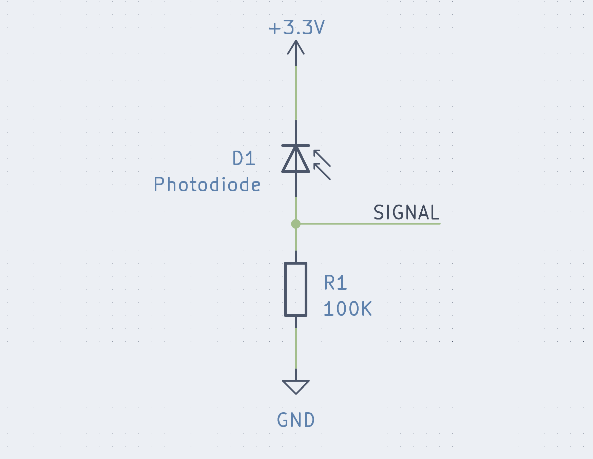

## Raspberry Pi Infrared Morse Code Communicator

Note, this repository is _NOT_ intended to be linked to the article hosting this project. Please replace the link in "Installing IR Communicator" section with that of the official github repository for this project. This repository will be made _private_ upon public release of the related videos.

### Parts List
- [Raspberry Pi](https://www.adafruit.com/product/4292)
- [Power Supply](https://www.adafruit.com/product/4298)
- [SD Card](https://www.adafruit.com/product/2693)
- [Raspi Display](https://www.adafruit.com/product/2423)
- [Infrared Photodiode](https://www.digikey.com/en/products/detail/vishay-semiconductor-opto-division/BPV10NF/1681136)
- [Infrared LED Driver](https://www.adafruit.com/product/5639)
- [Infrared LED (optional, may increase effective range)](https://www.adafruit.com/product/387)
- [Socket-to-Socket jumper wire](https://www.adafruit.com/product/3141)
- [2x20 Pin header extension (stacking header)](https://www.adafruit.com/product/1979)
- [100k Resistor](https://www.adafruit.com/product/2787)

Note, because this communicator is a two-way device, you will need two of everything if you wish to send messages back-and-forth between two parties.

### Tools Needed
---
- Computer capable of writing image to SD card
- Soldering Iron

These tools are optional, but recommended unless you're experienced with setting up "headless" raspberry pis over SSH or VNC

- Mini-HDMI to HDMI
- HDMI Monitor
- Keyboard + Mouse

### Assembly Instructions
Solder the resistor and wires to the infrared photodiode like so:
</img>

Connect the header included with the LED Driver to the driver.

Connect 3.3V power and ground from the Raspberry Pi computer to both the transmitter (Infrared LED Driver) and the reciever (Infrared photodiode and resistor).

Connect the signal wire (yellow) of the transmitter to GPIO 8

Connect the signal wire of the reciever to GPIO 9

See [this page](https://www.raspberrypi.com/documentation/computers/raspberry-pi.html) for more detail on the Raspberry Pi's pins

### Installation
- get Raspberry Pi OS running on Pi
	- see: [Installation](https://www.raspberrypi.com/software/)
#### Initial Configuration
Text that appears like `this` is entered into the command line (terminal) one command at a time. text in `<brackets>` is replaced (including the brackets) with the relevant folder or path for your case.

For example, `<project_directory>` for you might be replaced with `/home/alice/envmon`, if your username were alice.

The following commands are to be run one at a time.
- `sudo apt update && sudo apt upgrade`
- `sudo apt-get install i2c-tools git python3-pip`
- `sudo raspi-config`
	- enable i2c
	- enable spi
	- enable SSH
	- expand filesystem
	- reboot
- Log back in

#### Display Setup
If you are using the display listed in the parts list, follow Adafruit's instructions for installation.
[Display Install Instructions](https://learn.adafruit.com/adafruit-128x64-oled-bonnet-for-raspberry-pi/usage)

#### Installing The IR Communicator
Change directory to home, and clone the project using git.
- `cd ~`
- `git clone <link_to_project>` _REPLACE ME WITH ACTUAL PROJECT LINK!!!_
- `cd ./<project_dir>`

We make a python virtual environment so that we don't accidentally mess up other system-wide python dependencies.
- `python3 -m venv .venv`
- `source .venv/bin/activate`
- `pip3 install -r requirements.txt`

Note that "sourcing" this venv does not persist across rebooting or exiting the shell. `pip -V` will show the current python environment path, to see if you are in a venv or not.

#### Running the Program
- Once the hardware setup is complete, run the program.
- If you do not have the OLED Display Bonnet, run the program with the flag `--keyboard`
- `python3 ir_comm/main.py --keyboard`
- If you do have the bonnet, running the program with no arguments will use the joystick mode
- `python3 ir_comm/main.py`

With the program running, any characters recieved will show up on the bottom of the OLED display, or in the terminal while in "keyboard mode".

To send a message in keyboard mode, simply type your message, and it will be sent as you type the characters.

To send a message in the default (joystick) mode, up and down on the joystick will select characters or "space". Right and left will move the cursor. The button labeled "#5" will send the message all at once. The button labeled "#6" will clear the message without sending it.

#### Troubleshooting and Notes
- The IR Communicator, being based on light, only works with direct line-of-sight between sender and reciever
- Message length is limited to 140 characters
- The IR Communicator may have reduced range when used in direct sunlight, as the sun is a powerful source of infrared light.

#### Further Development
There are many types of character encoding beyond Morse code, can you think of any that might be more efficient or useful to you?

The logic in the morse translator can be applied to any digital signal; the infrared light can be replaced by sound, an electrical wire, or any other medium capable of representing "high" and "low" values.

Currently, the IR communicator doesn't implement a "start" or "end" symbol in its messages, like many other types of encoded communication. Can you think of ways to implement a "start" and "end" of transmission symbol?
